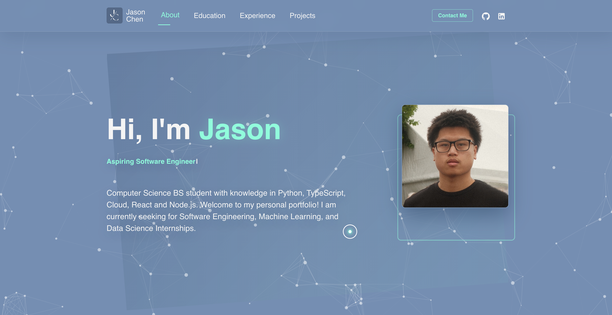

<h1 align="center"> 
jason-chen.dev - v2
</h1>

<p align="center"> 
The second iteration of <a href="https://jason-chen.dev"><a>jason-chen.dev
</p>

<p align="center">


</p>


## Getting Started

1. **Install dependencies:**
   ```bash
   npm install
   ```
2. **Run the development server:**
   ```bash
   npm run dev
   ```
3. **Build for production:**
   ```bash
   npm run build
   ```

## Tech Stack

- React 19 + TypeScript
- Vite
- Material UI, Bootstrap
- Node.js/Express (backend)

---

